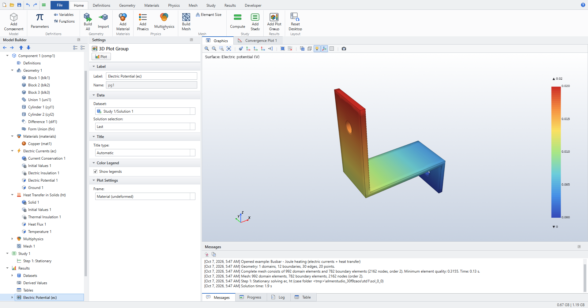
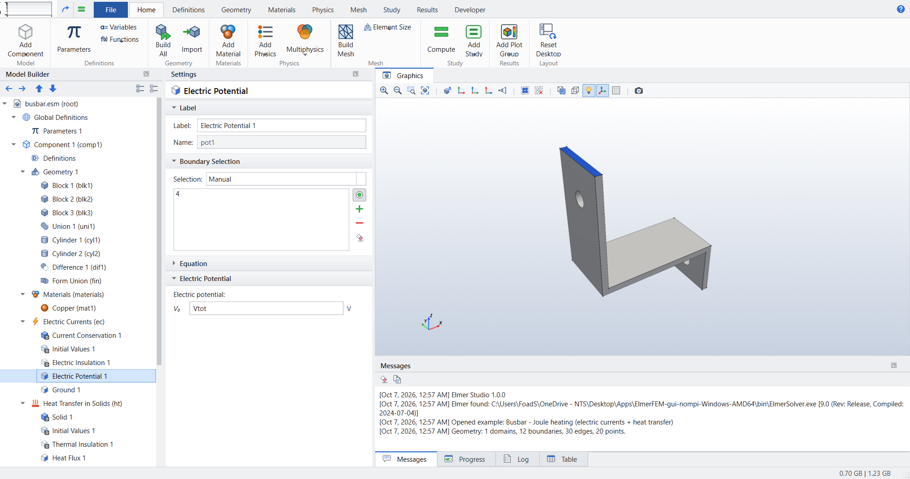
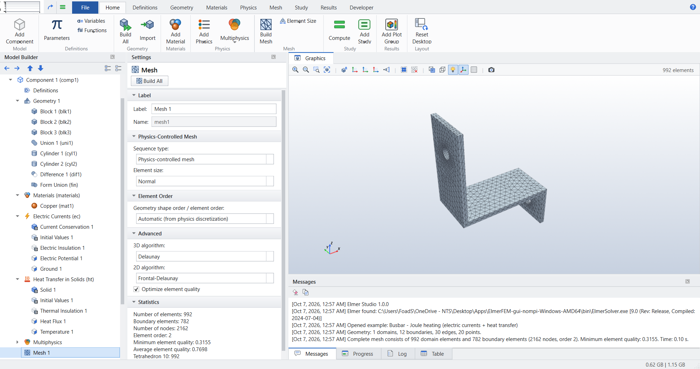
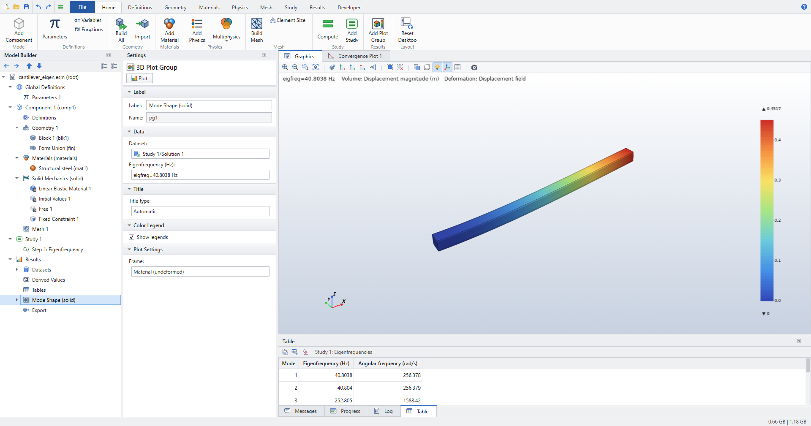
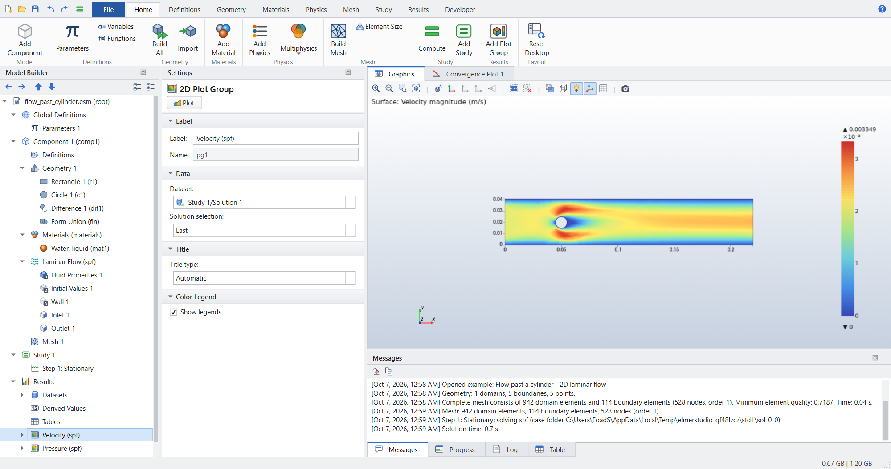
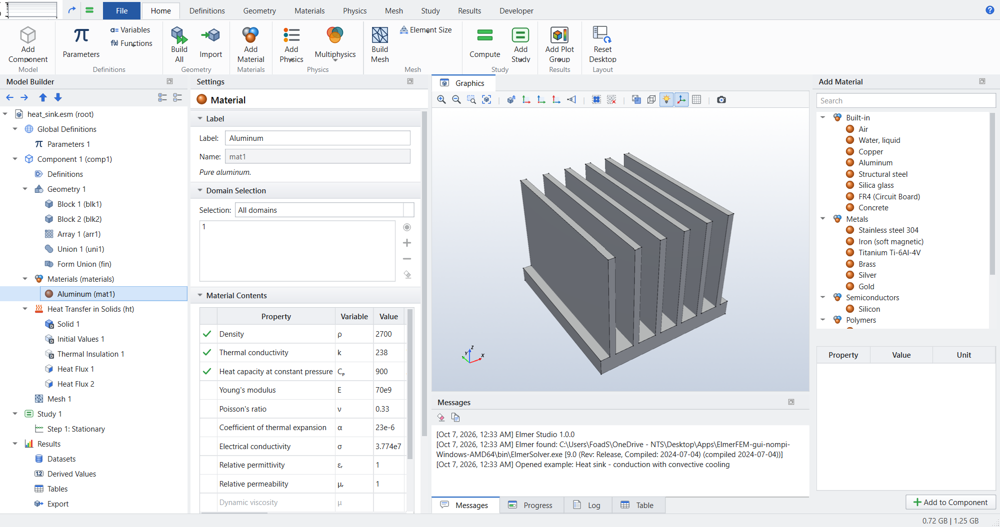
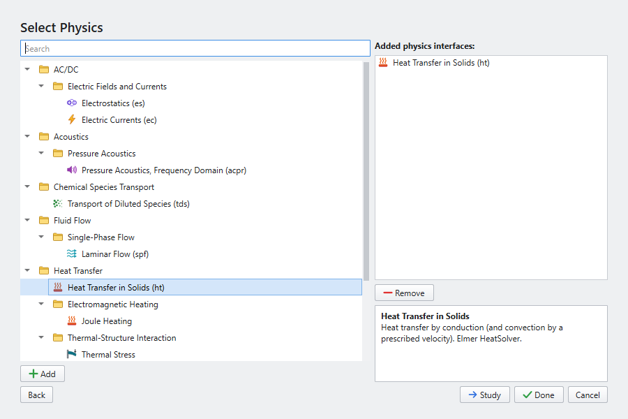

# Elmer Studio

A desktop model builder for the open-source **Elmer FEM** multiphysics solver, built around the
workflow and layout of COMSOL Multiphysics: the Model Builder tree, Settings windows, ribbon,
Graphics window with entity selection, Model Wizard, material library, studies and results.
Elmer Studio is an independent project. It is not affiliated with COMSOL AB, and it uses
original icons and no COMSOL assets.



| | |
|---|---|
|  |  |
|  |  |
|  |  |

## Download

Prebuilt portable bundles and installers (Windows setup + portable zip, macOS .dmg, Linux AppImage + tarball) are attached to each [GitHub Release](https://github.com/AltElmer/ElmerStudio/releases); every build is self-tested by launching the frozen app (and solving/plotting when Elmer is present). The packages do **not** include Elmer itself — install it separately (below). macOS builds are unsigned: right-click > Open the first time.

## Run it from source

Requirements: Python 3.10+ and an Elmer installation (ElmerSolver). Nothing depends on a particular GPU or
vendor library. The solver runs on the CPU, and graphics need any OpenGL 3.2 driver; see *Graphics without a GPU* below for the software fallback.

```bash
# Windows: double-click run_elmerstudio.bat   (creates .venv on first run)
# Linux/macOS:
./run_elmerstudio.sh
# or manually
python -m venv .venv && .venv/bin/pip install -r requirements.txt
.venv/bin/python -m elmerstudio                      # New window (Model Wizard / Blank Model / examples)
.venv/bin/python -m elmerstudio --example busbar     # open an Application Library example
.venv/bin/python -m elmerstudio model.esm            # open a saved model
```

**Elmer** is located automatically from `ELMER_HOME`, `PATH` or standard install folders, and can be set in
*File > Preferences*. You can get it from:

- Windows: the prebuilt installers at <http://www.nic.funet.fi/pub/sci/physics/elmer/bin/windows/>.
- Ubuntu/Debian: `ppa:elmer-csc-ubuntu/elmer-csc-ppa` → `apt install elmerfem-csc`.
- macOS: Homebrew or a source build.

To run on several cores, set *Study > Number of MPI processes*. This needs an MPI build of Elmer (`ElmerSolver_mpi` plus `mpiexec`); the mesh is partitioned with ElmerGrid.

## What is there

| COMSOL concept | Elmer Studio | Elmer back end |
|---|---|---|
| Model Builder / Settings / Graphics / Messages, Progress, Log, Table | same windows, dockable, *Reset Desktop* | — |
| Ribbon: Home, Definitions, Geometry, Materials, Physics, Mesh, Study, Results, Developer | same tabs and groups, Quick Access Toolbar, File menu | — |
| Model Wizard (space dimension → physics → study), Blank Model, Application Libraries | yes; 7 example models | — |
| Parameters with units (`10[mm]`, `20[degC]`), Variables, Analytic and Interpolation functions | yes, unit-aware evaluation, parameter table Load/Save | MATC expressions, tables |
| Geometry: Block, Sphere, Cylinder, Cone, Torus, Ellipsoid, Rectangle, Circle, Ellipse, Polygon, Work Plane + Extrude/Revolve, Union/Difference/Intersection, Move/Copy/Rotate/Scale/Mirror/Array, Fillet/Chamfer, STEP/IGES/BREP import, Form Union | yes, with length units, Build Selected (F7) / Build All (F8) | gmsh / OpenCASCADE |
| Domain/boundary/edge/point numbering and click-selection with hover highlight | yes (position-based numbering, blue selection, red hover) | — |
| Materials, Material Contents table with required-property status, material library | yes, 20 materials, user materials | Material sections |
| Physics-controlled mesh (Extremely fine … Extremely coarse, fluid calibration), user-controlled Size / Free Tetrahedral / Free Triangular / Free Quad / Distribution, statistics, quality plot | yes | gmsh → native Elmer mesh with parent elements |
| Studies: Stationary, Time Dependent, Eigenfrequency, Frequency Domain (sweeps), Parametric Sweep, Solver Configurations | yes | Steady / Transient (BDF) / Eigen (ARPACK) / Scanning |
| Results: 3D/2D/1D plot groups; Surface, Volume, Slice, Isosurface, Contour, Arrow, Streamline, Mesh, Line, Deformation, Line Graph, Global; Revolution 2D; color tables; unit conversion | yes | VTU results |
| Derived values: Volume/Surface Integration, Average, Maximum, Point Evaluation, Global (eigenfrequencies) → Tables | yes | — |
| Export: Image, Data (CSV), VTU, HTML Report; Convergence Plot during solve | yes | — |
| Undo/Redo, rename, duplicate, disable/enable, move, context menus, keyboard shortcuts | yes | — |
| Model file with solutions (`.mph`) | `.esm` (zip of model JSON + solutions) | — |
| Method/Java shell | *Developer > Run Python Script* (scripting API, see below); *Show Elmer Input File*; *Export Elmer Case* | `.sif` |

### Physics interfaces

| Interface | Features | Elmer solver |
|---|---|---|
| Heat Transfer in Solids (ht) | Solid, Fluid (prescribed or spf velocity), Heat Source, Temperature, Heat Flux (general/convective), Surface-to-Ambient Radiation, Symmetry, Thermal Insulation | HeatSolver + FluxSolver |
| Solid Mechanics (solid) | Linear Elastic Material, Body Load, Gravity, Fixed Constraint, Prescribed Displacement, Roller, Symmetry, Boundary Load (force/pressure), Spring Foundation; plane stress/strain | StressSolver (stationary, eigenfrequency) |
| Electrostatics (es) | Charge Conservation, Space Charge Density, Ground, Electric Potential, Surface Charge Density, Zero Charge | StatElecSolver |
| Electric Currents (ec) | Current Conservation, Ground, Electric Potential, Normal Current Density, Electric Insulation | StatCurrentSolver |
| Magnetic Fields (mf), 2D and 2D axisymmetric | Ampère's Law, External Current Density, Magnetic Insulation, Magnetic Potential, Perfect Magnetic Conductor | MagnetoDynamics2D + CalcFields |
| Laminar Flow (spf) | Fluid Properties, Volume Force, Gravity, Wall (no slip/slip), Inlet (velocity/pressure), Outlet, Symmetry, Open Boundary; Stokes option | FlowSolve (stabilized P1-P1) |
| Pressure Acoustics, Frequency Domain (acpr) | Sound Hard/Soft, Pressure, Normal Acceleration, Impedance, Plane Wave Radiation; SPL | HelmholtzSolver |
| Transport of Diluted Species (tds) | Transport Properties (diffusion + convection, or spf velocity), Reactions, Concentration, Flux, mass transfer, No Flux | ModelPDE |
| Coefficient Form PDE (pde) | c, a, f, d_a, β coefficients; Dirichlet, Flux/Source, Zero Flux | ModelPDE |
| Multiphysics | Electromagnetic Heating (Joule), Thermal Expansion, Nonisothermal Flow (with Boussinesq buoyancy) | coupled Elmer solvers |

Material properties may depend on fields and coordinates, for example `k0*(1+0.002*(T-293.15[K]))`. Expressions like this are translated to Elmer MATC code, and the affected solvers then switch to nonlinear iteration automatically.
Default boundary features (insulation, wall, …) apply to *exterior* boundaries only, as in COMSOL.
Each interface has an *Additional Elmer solver keywords* box for anything not exposed in the GUI.

## Verified against closed-form solutions

`tests/test_pipeline.py` runs real ElmerSolver jobs built by the GUI's model layer:

| Case | Result |
|---|---|
| 3D conduction, fixed end temperatures (linear profile) | max error 1.7e-11 K |
| Slab with uniform heat source, T_max = QL²/8k | rel. error 9e-16 |
| Cantilever tip deflection vs Euler–Bernoulli | 0.3 % (3D/shear effects) |
| Cantilever first eigenfrequency vs 1.875²/(2π)·√(EI/ρAL⁴) | 40.80 vs 40.77 Hz |
| 2D parallel-plate capacitor potential | max error 1.6e-13 V |
| Poiseuille channel, centerline vs 1.5·Q/H | 0.13 %, mass balance exact |
| 1D diffusion, linear profile | 4e-14 |
| Acoustic duct, p = p₀ sin k(L−x)/sin kL | 3e-8 Pa |
| Transient conduction (BDF2) | 10 output steps |

Other test suites:

- `tests/test_examples.py` solves all 7 examples.
- `tests/test_runner_results.py` covers the parametric sweep, integrals, point/line evaluation and the save/load round trip.
- `tests/test_gui_smoke.py` drives the real main window through nearly every command and fails on any exception or error message.
- `tools/screenshot_tour.py` regenerates the screenshots in `docs/screenshots/`.

## Scripting

The GUI is built on a scripting API, which you can use headless or from *Developer > Run Python Script*:

```python
from elmerstudio.core import builder as B
from elmerstudio.core.geometry import build_geometry
from elmerstudio.core.study_runner import StudyRunner
from elmerstudio.core.elmer import find_elmer

m = B.new_model("3D", ["ht"], "stationary")
m.create("geom.block", m.component.child("geometry"), index=0, w="0.1", d="0.02", h="0.01")
B.add_material(m, "Copper", all_domains=True)
geo = build_geometry(m, display=False)
ht = m.component.child("physics.ht")
B.add_feature(m, ht, "ht.temperature", geo.select("boundary", xmax=0), T0="20[degC]")
B.add_feature(m, ht, "ht.heatflux", geo.select("boundary", xmin=0.1), q0="1e4[W/m^2]")
folders = StudyRunner(m, m.studies()[0], "work", find_elmer()).run()
```

## Graphics without a GPU

VTK needs OpenGL 3.2. On machines with no GPU driver (VMs, remote desktops, CI), use Mesa's software rasterizer:

- Linux: `pip install vtk-osmesa`, or run under `LIBGL_ALWAYS_SOFTWARE=1`.
- Windows: put Mesa's `opengl32.dll` from mesa-dist-win next to `python.exe` in `.venv`.

Without any usable OpenGL, the Graphics window shows a notice and everything else still works.

## Architecture

```
elmerstudio/core   GUI-independent: model tree + schema registry, units/expressions, geometry (gmsh OCC),
                   meshing + Elmer mesh writer, physics → SIF generator, Elmer runner, results, examples
elmerstudio/ui     PySide6: ribbon, model builder, schema-driven settings, VTK graphics, plots, panes, wizard
tests/, tools/     regression suites, GUI smoke test, screenshot tours, icon contact sheet
```

## Known gaps compared with COMSOL

These are deliberately listed, so nobody assumes they exist:

- **Not available yet:**
  - 3D magnetic fields (A-V formulation);
  - turbulence;
  - structural transient and frequency response;
  - contact;
  - Form Assembly with identity pairs;
  - named selections;
  - probes;
  - animations;
  - adaptive meshing;
  - LiveLink-style CAD sync;
  - the Application Builder.
- **Partly supported:**
  - mesh element growth rate is not exposed;
  - boundary-layer meshing is not exposed;
  - materials are constant (20 °C) unless you enter an expression;
  - the physics-controlled mesh does not refine automatically for physics, apart from the fluid calibration.
- **Approximations:**
  - integrals over quadratic elements use VTK's linearized cells (≈0.1 % on smooth fields);
  - unit expressions are converted to SI, but dimensional consistency is not checked.
- **Parallel:** MPI runs need an MPI-enabled Elmer. The Windows `-nompi` build runs serially.
